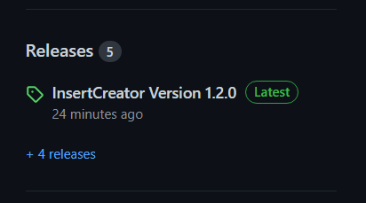

# Insertcreator

Software to Create Inserts for Divine service livestreams
Contains the song numbers and titles of the German hymnal as well as the German choir book of the New Apostolic Church

See [InsertCreator-Wiki](https://github.com/heiko95/InsertCreator/wiki)

## Summary

- Create hymnal Inserts
- Create ministrie Inserts
- Create custom Inserts
- Default mode for creating inserts directly 
- Studio mode with preview window and historyview

## Getting Started

- Download Last Release

- Execute Setupexe
- Follow Installer Instruction

## Using with OBS

- Insert Creator creates a file named insert.png in the directory C:\Users\username\InsertCreator
- Create an image source in OBS with this file
- Each time a new insert is created, this file is overwritten by the software and automatically updated in OBS.

## Using with Atem-Mini

- In the settings of Insert crator the option "Fade in on second monitor" can be activated
- In the settings of Insert crator the option "Use greenscreen background" can be activated.
- Connect the PC/laptop to a camera input on the Atem-Mini
- activate chroma-key of the Atem-Mini on this camera input

